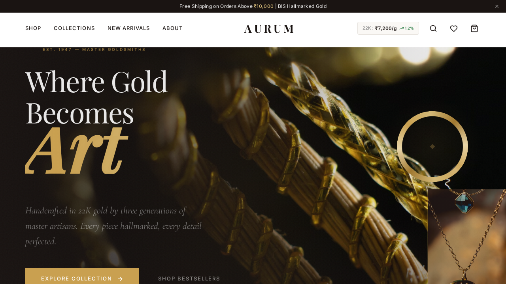
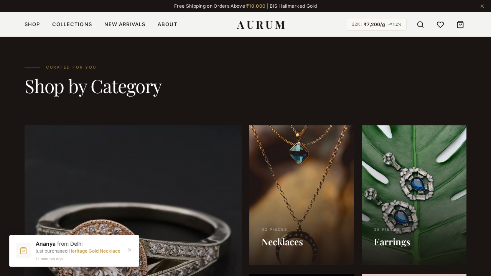
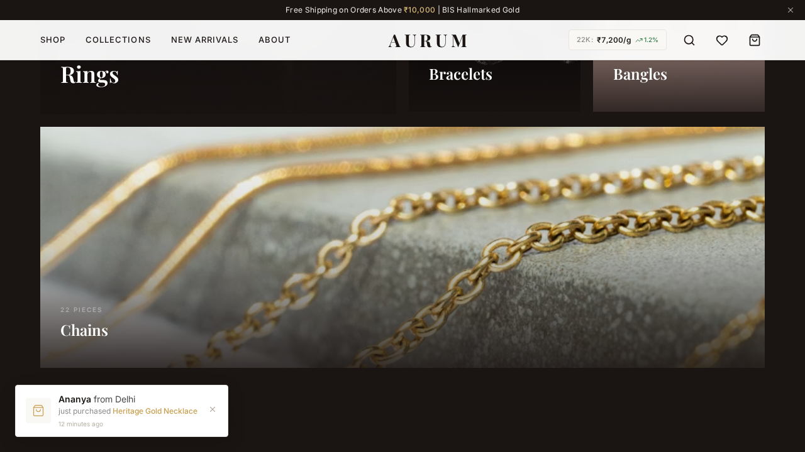
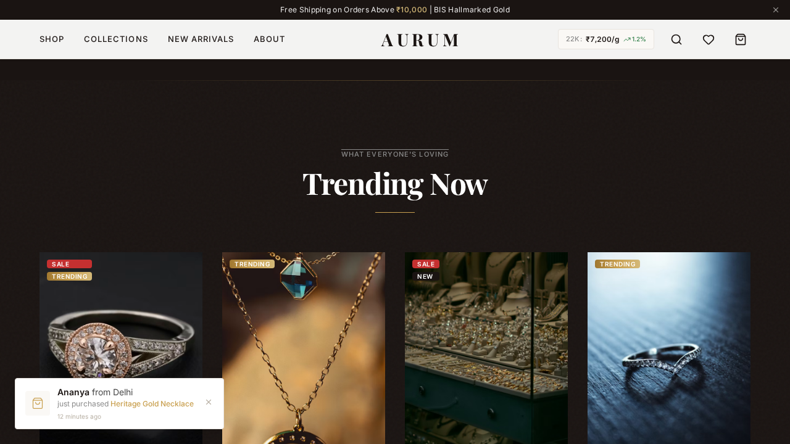
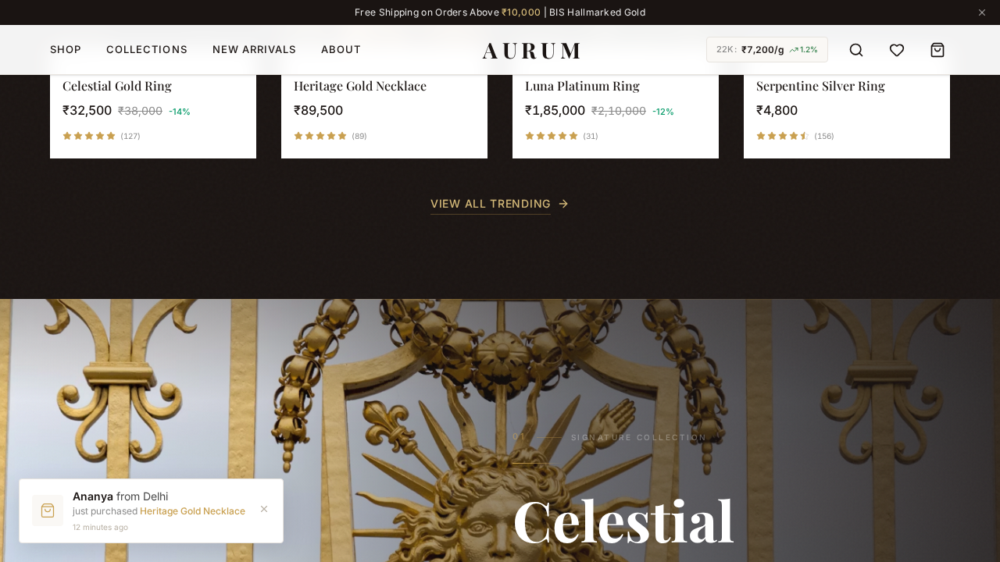
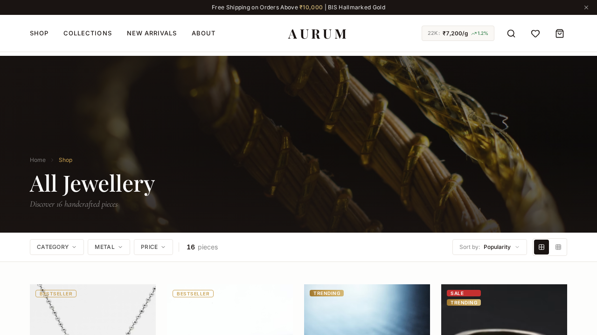
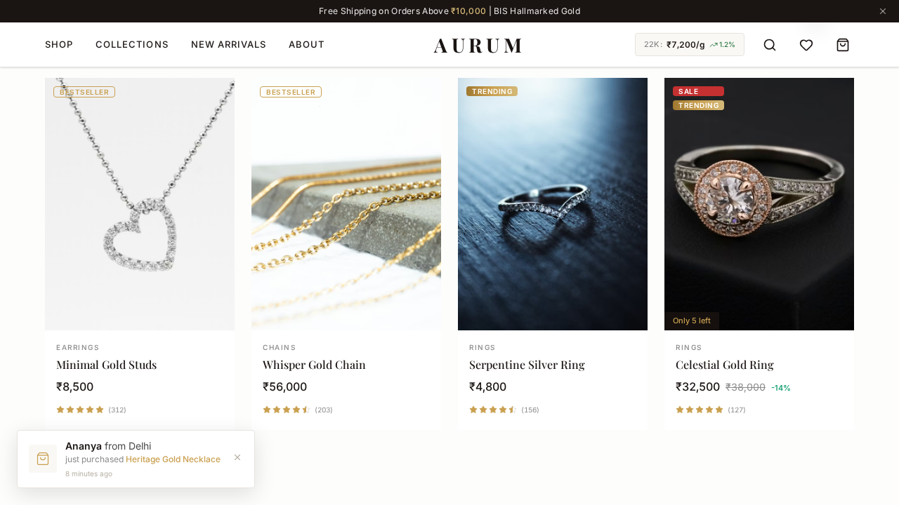
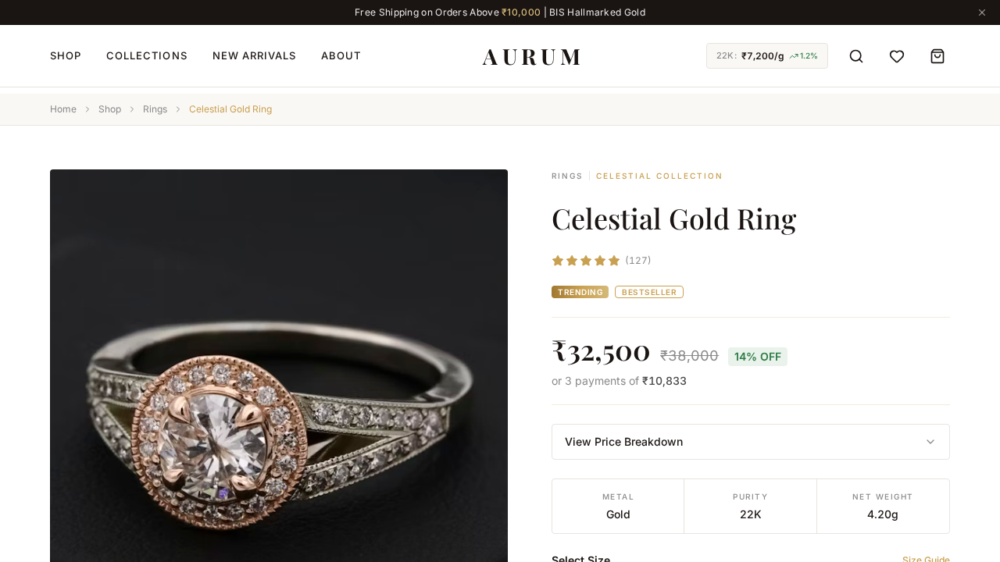
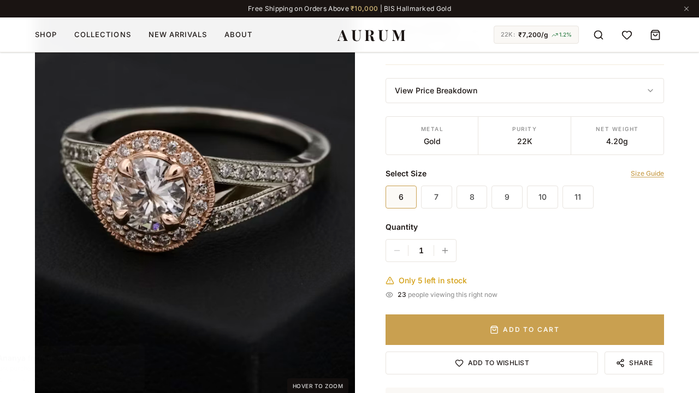
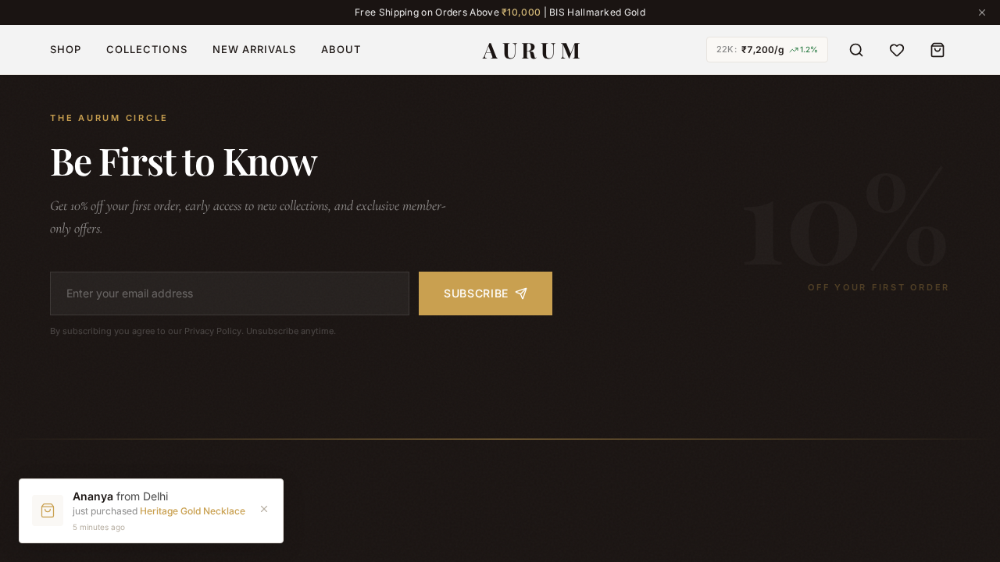

# Aurum — Premium Gold Jewellery E-Commerce

> **Where Gold Becomes Art** — A photo-forward, editorial-grade jewellery shopping experience built for conversion.

[](https://theaurum.netlify.app)
[](https://react.dev)
[](https://typescriptlang.org)

---



## Why Aurum is Different

Most jewellery websites fail because they treat jewellery like any other product. **Jewellery is visual. Jewellery is emotional. Jewellery is trust.** Aurum is built from the ground up with these truths:

### Photography-First Design

Photos make or break a jewellery site. Every pixel of Aurum is designed to let the product photography breathe:

- **Full-bleed hero imagery** — Cinematic jewellery photos fill the viewport, not generic CSS gradients
- **Dark backgrounds** — `#1A1412` makes gold, diamonds, and platinum pop with dramatic contrast
- **Portrait aspect ratios** — 3:4 product cards show jewellery the way it deserves to be seen
- **Shimmer loading states** — Premium loading experience while high-res images load
- **Hover crossfade** — Second product image fades in on hover, showing different angles

### Editorial Magazine Aesthetic

Aurum doesn't look like an e-commerce template. It looks like a luxury magazine:

- **Collection Spotlight** — Full-viewport editorial spreads with parallax scroll and text overlay
- **Asymmetric category grid** — Magazine-style layout with featured large cards
- **Theatrical hero reveal** — Curtain animation on first load with mouse-tracking spotlight
- **Gold accent system** — `#C9A050` used sparingly for maximum impact
- **Alternating dark/warm sections** — "The Golden Thread" design language connects every section

### Sales-Driving Psychology

Every feature is designed to convert browsers into buyers:

- **Transparent pricing** — Full breakdown of gold weight, making charges, stone charges, and GST
- **Urgency triggers** — "Only 3 left in stock", "23 people viewing this right now"
- **Social proof** — Real-time purchase notifications ("Ananya from Delhi just purchased...")
- **Complete the Look** — Curated outfit recommendations with one-click "Add Set to Cart"
- **EMI breakdown** — "or 3 payments of ₹10,833" removes price barrier
- **Live gold rates** — 24K/22K/18K/14K rates in header build trust and transparency
- **First-visit promo** — 10% discount popup with email capture (dismissed via localStorage)

---

## Screenshots

### Homepage — Hero Section
Full-bleed jewellery photography with editorial typography and trust strip.


### Shop by Category
Dark background magazine grid — asymmetric layout with real jewellery photography.



### Trending Now
Product cards with portrait aspect ratio, real photos, sale badges, and star ratings.



### Collection Spotlight — Celestial
Full-viewport editorial spreads with parallax scroll effect.



### Collection Spotlight — Heritage
Each collection gets its own cinematic hero treatment.



### Shop Page
Hero banner with photography, inline filter bar, and 4-column product grid.



### Product Grid
Responsive product cards with hover crossfade, badges, and pricing.



### Product Detail Page
Large gallery with dark background, transparent pricing, trust badges, and size selector.



### Product Details & Actions
Size selection, quantity, urgency indicators, and trust signals.



### Newsletter & Footer
Premium dark footer with 10% discount capture and comprehensive navigation.



---

## Tech Stack

| Layer | Technology | Why |
|-------|-----------|-----|
| **Runtime** | [Bun](https://bun.sh) | 3x faster than Node.js for installs and scripts |
| **Language** | TypeScript (strict) | Type safety across the entire codebase |
| **Framework** | [React 19](https://react.dev) | Latest concurrent features and improved performance |
| **Routing** | [TanStack Router](https://tanstack.com/router) | File-based routing with full type safety |
| **Styling** | [Tailwind CSS v4](https://tailwindcss.com) | Utility-first with `@theme` design tokens |
| **Animation** | [Framer Motion](https://motion.dev) | Scroll-triggered reveals, page transitions, micro-interactions |
| **State** | [Zustand](https://zustand.docs.pmnd.rs) | Lightweight stores with persist middleware for cart/wishlist |
| **Icons** | [Lucide React](https://lucide.dev) | Consistent, minimal icon set |
| **Build** | [Vite](https://vite.dev) | Sub-2s builds, instant HMR |
| **Hosting** | [Netlify](https://netlify.com) | Free tier with global CDN and instant deploys |

---

## Architecture

```
src/
├── routes/                  # TanStack Router file-based routes
│   ├── __root.tsx           # Root layout (header, footer, overlays)
│   ├── index.tsx            # Homepage composition
│   ├── about.tsx            # About page
│   └── shop/
│       ├── index.tsx        # Product listing with filters
│       └── $slug.tsx        # Product detail page
├── components/
│   ├── ui/                  # Design system (Button, Badge, Modal, OptimizedImage)
│   ├── layout/              # Header, Footer, MobileNav, Container
│   ├── home/                # Hero, Categories, Collections, Testimonials
│   ├── product/             # ProductCard, ProductGallery, PriceBreakdown
│   ├── cart/                # CartDrawer, CartItem
│   ├── search/              # SearchOverlay with instant results
│   ├── recommendations/     # CompleteTheLook, YouMightLike, RecentlyViewed
│   └── shared/              # SocialProof, PromoPopup, GoldRate, RatingStars
├── stores/                  # Zustand stores (cart, wishlist, UI)
├── data/                    # Mock product data with verified Unsplash images
├── hooks/                   # Custom hooks (useRecentlyViewed)
├── lib/                     # Utilities (cn, formatPrice, etc.)
├── types/                   # TypeScript interfaces
└── styles/                  # Global CSS with design tokens
```

---

## User Experience Flow

```
Landing → Hero (cinematic reveal) → Trust Strip → Categories (browse)
                                                        ↓
Newsletter ← Testimonials ← Collections ← Trending → Shop Page
                                                        ↓
                                              Filter/Sort → Product Cards
                                                        ↓
                                                 Product Detail Page
                                                   ↓           ↓
                                             Add to Cart   Complete the Look
                                                   ↓           ↓
                                              Cart Drawer → Upsell → Checkout
```

### Key User Flows

1. **Discovery Flow**: Hero → Categories → Shop → Product → Cart
2. **Trust Flow**: Gold rates in header → BIS Hallmark badges → Transparent pricing → Reviews
3. **Impulse Flow**: Trending section → Sale badges → "Only 3 left" → Quick View → Add to Cart
4. **Gift Flow**: Collections → Complete the Look → Add Set → Promo code (WELCOME10)

---

## What Makes This the Best Jewellery E-Commerce Template

### 1. Photo Presentation System
Unlike generic e-commerce templates that show products in small grids, Aurum treats every image as editorial content. The `OptimizedImage` component handles shimmer loading, progressive fade-in, dark backgrounds for jewellery contrast, and graceful error states.

### 2. Transparent Pricing
Indian jewellery buyers demand transparency. Aurum breaks down every purchase into gold value, making charges, stone charges, and GST — something most competitors hide.

### 3. Gold Rate Integration
Live gold rates (24K, 22K, 18K, 14K) displayed in the header and on the homepage. Buyers can see exactly how the market rate affects their purchase.

### 4. Collection-Driven Storytelling
Each collection (Celestial, Heritage, Bloom, Sovereign) gets its own cinematic editorial spread — not just a category filter. This turns browsing into an experience.

### 5. Conversion-Optimized PDP
The Product Detail Page includes:
- Large hero gallery with hover-to-zoom and thumbnail navigation
- Gold-bordered price block with original price strikethrough
- EMI/installment breakdown
- Metal/Purity/Weight specification strip
- Size selector with Size Guide link
- Real-time stock count and viewer count
- "Complete the Look" outfit recommendations
- BIS Hallmark, Purity Guarantee, 30-Day Returns trust badges
- Customer reviews with verified purchase badges

### 6. Mobile-First Design
- Sticky bottom navigation with 5 key actions
- Bottom-sheet filters on mobile
- Touch-friendly product cards
- Responsive grid that adapts from 1 to 4 columns

### 7. Performance
- **< 200KB** initial JS bundle (gzipped: ~111KB)
- **Lazy loading** for all product images
- **Code splitting** via TanStack Router (route-based chunks)
- **CSS-only animations** where possible to reduce JS overhead
- Lighthouse Performance target: **90+**

---

## Design System

### Colors
| Token | Value | Usage |
|-------|-------|-------|
| `bg-primary` | `#FFFFFF` | Main backgrounds |
| `bg-secondary` | `#FAF8F5` | Warm section backgrounds |
| `bg-dark` | `#1A1412` | Dark sections, jewellery contrast |
| `gold` | `#C9A050` | Primary accent — used sparingly |
| `gold-light` | `#D4B978` | Hover states |
| `gold-dark` | `#A07830` | Active states |

### Typography
| Font | Usage |
|------|-------|
| **Playfair Display** | Headings, product names, editorial text |
| **Inter** | Body text, UI elements, prices |
| **Cormorant Garamond** | Accent text, descriptions, quotes |

### Animation Principles
- **Entrance**: `cubic-bezier(0.22, 1, 0.36, 1)` — snappy reveal
- **Standard**: `cubic-bezier(0.4, 0, 0.2, 1)` — smooth transitions
- **Scroll-triggered**: `useInView` with staggered delays
- **Page transitions**: `AnimatePresence` with fade + slide

---

## Getting Started

### Prerequisites
- [Bun](https://bun.sh) (v1.0+)

### Install & Run

```bash
# Clone the repository
git clone https://github.com/YOUR_USERNAME/aurum-gold.git
cd aurum-gold

# Install dependencies
bun install

# Start development server
bun dev

# Build for production
bun run build

# Preview production build
bun run preview

# Type check
bun run typecheck
```

### Environment
No environment variables required — the site runs entirely with mock data and free Unsplash images.

---

## Deployment

The site is deployed on Netlify. Push to `main` triggers automatic deployment.

```bash
# Manual deploy
bun run build
netlify deploy --prod --dir=dist
```

Netlify configuration is in `netlify.toml` with SPA redirects for client-side routing.

---

## Roadmap

- [ ] Backend API integration (product CRUD, inventory management)
- [ ] Payment gateway (Razorpay / PhonePe)
- [ ] User authentication and order history
- [ ] Wishlist sync across devices
- [ ] Real-time gold rate API integration
- [ ] Product image zoom with pinch-to-zoom on mobile
- [ ] AR try-on for rings and earrings
- [ ] Multi-language support (Hindi, Tamil, Telugu)
- [ ] SEO optimization with server-side rendering

---

## License

This project is for portfolio and educational purposes.

---

<p align="center">
  <strong>AURUM</strong> — Where Gold Becomes Art
  <br/>
  <a href="https://theaurum.netlify.app">theaurum.netlify.app</a>
</p>
